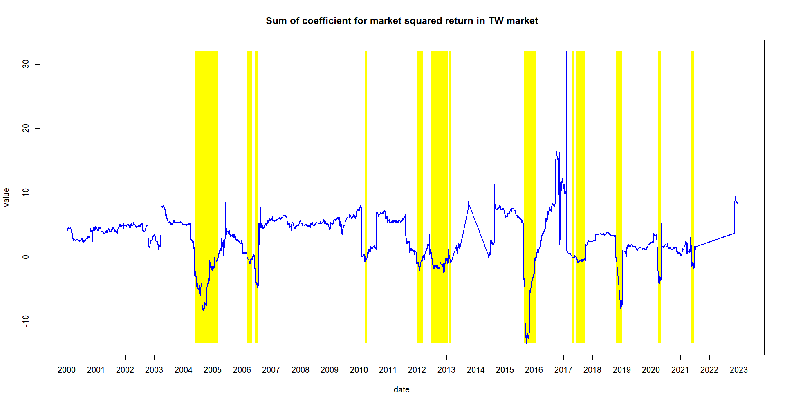

#Studying Herding Behavior in Taiwan
1. Preprocessing the Data: Since I use daily public stock data in Taiwan spanning over twenty years (with millions of rows), I first download the data from TEJ and then import it into my SQL database.
2. Grouping the Data in SQL: Since I am interested in the herding effect at the industry level, I group stocks by industry in SQL and calculate their overall returns.
3. Running the Rolling VAR Regression: Finally, I perform a rolling VAR regression to analyze the results

